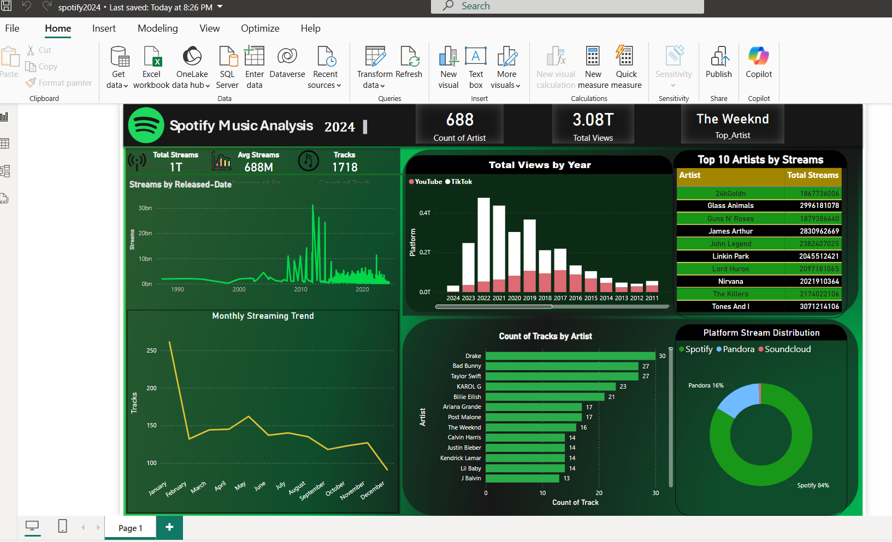

# spotify-music-analysis-2024

 

🎵 Spotify Music Analysis 2024 Dashboard

📌 Overview

This Power BI dashboard provides a comprehensive analysis of Spotify's 2024 music streaming data. It highlights key trends, top artists, streaming platform distribution, and overall music consumption patterns.

📊 Key Insights

1️⃣ Top Artists & Most Streamed Songs

The Top 10 Artists by Streams are dominated by AkhilN, Glass Animals, and Guns N' Roses.

The most streamed tracks showcase a mix of new releases and timeless hits.

2️⃣ Music Streaming Trends Over Time

Streaming activity peaked in certain years and months, indicating seasonal trends in music consumption.

A steady rise in music streaming is evident, with spikes around major music releases and events.

3️⃣ Platform-Wise Streaming Distribution

Spotify remains the dominant platform, while Pandora and SoundCloud also contribute to significant streams.

YouTube streaming data is available, showing another major influence on music trends.

4️⃣ Historical Music Impact

Analysis of streams by song release date shows how older music continues to be popular.

Several pre-2000 songs still have a strong listener base, proving the timeless appeal of certain artists.

📌 Features

✅ Interactive Visuals: Power BI dashboard with filters for deeper analysis.✅ Streaming Trend Analysis: Monthly and yearly streaming patterns.✅ Platform Comparison: Spotify vs. Pandora vs. SoundCloud.✅ Top Artist & Track Performance: Identify the leading artists and songs.

🛠 Tools & Technologies Used

Power BI for interactive data visualization

Spotify Dataset (2024) from Kaggle

Data Cleaning & Transformation in Power BI

📎 How to Use

Download the Power BI file (.pbix) from this repository.

Open it in Power BI Desktop.

Explore the interactive dashboard using filters and visuals.

📥 Dataset Source-
The dataset is sourced from Kaggle – Spotify Music Streaming Data (2024).
   
⭐ If you like this project, don't forget to star ⭐ the repository!

